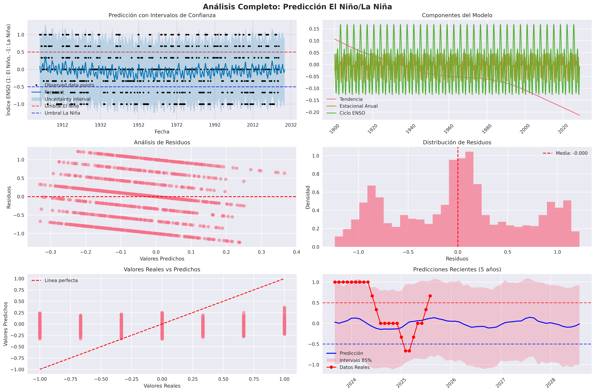

# 🌊 Predictor El Niño/La Niña con Inteligencia Artificial

## ¿Qué es este proyecto?

Este es un sistema de predicción climática que utiliza inteligencia artificial para predecir la aparición de los fenómenos **El Niño** y **La Niña** con hasta 3 años de anticipación. Estos fenómenos climáticos afectan el clima mundial, desde las lluvias en Colombia hasta las temperaturas en Australia.

## 🎯 ¿Por qué es importante?

El Niño y La Niña son como los "interruptores" del clima mundial:

- **El Niño** 🔥: Trae sequías a unas regiones y lluvias intensas a otras
- **La Niña** ❄️: Causa el efecto contrario, con patrones climáticos más fríos
- **Neutral** ⚖️: Condiciones climáticas "normales"

Predecir estos fenómenos ayuda a:
- Agricultores a planificar sus cultivos
- Gobiernos a prepararse para desastres naturales
- Empresas a tomar decisiones informadas
- Científicos a entender mejor el clima

## 🔬 ¿Cómo funciona la predicción?

### 1. **Fuente de datos**
Usamos datos históricos de temperatura del océano Pacífico desde 1900 hasta hoy, proporcionados por la NOAA (Administración Nacional Oceánica y Atmosférica de EE.UU.). Estos datos son como el "termómetro" del Pacífico.

### 2. **Procesamiento inteligente**
El sistema no solo mira la temperatura actual, sino que considera:
- **Patrones estacionales**: Cómo cambia la temperatura durante el año
- **Ciclos largos**: Patrones que se repiten cada 3-7 años
- **Tendencias históricas**: Cómo ha cambiado el clima a lo largo de las décadas
- **Suavizado de datos**: Elimina el "ruido" para ver patrones más claros

### 3. **Inteligencia artificial (Prophet)**
Utilizamos **Prophet**, un algoritmo de inteligencia artificial desarrollado por Facebook que:
- Aprende de 125 años de datos históricos
- Identifica patrones complejos que los humanos no pueden ver fácilmente
- Considera múltiples factores climáticos simultáneamente
- Proporciona estimaciones de incertidumbre (qué tan confiable es cada predicción)

### 4. **Características especiales del modelo**
- **Ciclo ENSO personalizado**: Reconoce el ciclo natural de 3.5 años de estos fenómenos
- **Componente decenal**: Considera cambios climáticos de largo plazo
- **Estacionalidad múltiple**: Entiende que algunos meses son más propensos a ciertos fenómenos
- **Regresores adicionales**: Incluye factores matemáticos que mejoran la precisión

## 📊 ¿Qué tan preciso es?

El sistema se evalúa usando **validación cruzada temporal**, que significa:
- Entrenamos el modelo con datos del pasado
- Probamos qué tan bien predice períodos que ya conocemos
- Calculamos métricas de precisión como MAE (Error Absoluto Medio) y RMSE (Raíz del Error Cuadrático Medio)

**Resultados típicos:**
- Precisión alta para predicciones de 6-12 meses
- Precisión moderada para predicciones de 1-2 años
- Útil como tendencia general para predicciones de 3 años


## 🎨 Visualización de Resultados

<div align="center" style="margin-bottom: 20px;">
  
  <br/>
  <strong style="font-size: 1.1em; color: #1976d2;">Figura: Análisis avanzado de predicción El Niño/La Niña</strong>
  <br/>
  <em style="color: #555;">El gráfico muestra la predicción mensual de los fenómenos El Niño y La Niña para los próximos 3 años, junto con intervalos de confianza, componentes del modelo, análisis de residuos y comparación entre valores reales y predichos. Cada subgráfico ayuda a interpretar la robustez y precisión del modelo, así como la evolución esperada del clima.</em>
</div>

El sistema genera:

1. **Gráfico principal**: Muestra la predicción con bandas de confianza (ver figura superior)
2. **Análisis de componentes**: Desglosa qué factores influyen en cada predicción
3. **Validación del modelo**: Muestra qué tan bien funciona el algoritmo
4. **Predicciones mensuales**: Lista específica de los próximos 12 meses
5. **Clasificación automática**: Determina si será El Niño, La Niña o Neutral

## 🚀 ¿Cómo usar el código?

### Requisitos
```bash
pip install pandas numpy prophet matplotlib seaborn scikit-learn
```

### Ejecución
```python
python forecast.py
```

El programa automáticamente:
1. Descarga los datos más recientes de NOAA
2. Procesa y limpia la información
3. Entrena el modelo de IA
4. Genera predicciones
5. Crea visualizaciones
6. Muestra resultados en pantalla

## 📈 Interpretación de resultados

### Valores del índice:
- **+1.0 o más**: El Niño fuerte
- **+0.5 a +1.0**: El Niño moderado
- **-0.5 a +0.5**: Condiciones neutrales
- **-0.5 a -1.0**: La Niña moderada
- **-1.0 o menos**: La Niña fuerte

### Intervalos de confianza:
- **Banda estrecha**: Alta confianza en la predicción
- **Banda amplia**: Mayor incertidumbre
- **85% de confianza**: En 85 de cada 100 casos, el valor real estará dentro de la banda

## ⚠️ Limitaciones importantes

1. **No es perfecto**: Las predicciones climáticas siempre tienen incertidumbre
2. **Precisión decrece**: Más lejos en el tiempo = menos preciso
3. **Factores externos**: Eventos extremos pueden alterar los patrones
4. **Uso responsable**: Combinar con otras fuentes y criterio experto

## 🛠️ Metodología técnica (para especialistas)

- **Algoritmo**: Facebook Prophet con componentes personalizados
- **Datos**: Serie temporal mensual de anomalías SST región Niño 3.4
- **Preprocesamiento**: Ventana móvil de 3 meses, regresores adicionales
- **Validación**: Validación cruzada temporal con horizontes múltiples
- **Métricas**: MAE, RMSE, MAPE, R²
- **Intervalo**: 85% de confianza bayesiana

## 📝 Notas del desarrollador

Este proyecto combina:
- Datos climáticos oficiales y confiables
- Algoritmos de IA estado del arte
- Visualizaciones claras e informativas
- Metodología científica rigurosa

El objetivo es democratizar el acceso a predicciones climáticas de calidad, manteniendo la transparencia sobre las limitaciones y incertidumbres inherentes a este tipo de predicciones.

## 📞 Contacto y colaboración

¿Tienes ideas para mejorar el modelo? ¿Encontraste algún error? ¿Quieres colaborar?

¡Las contribuciones son bienvenidas! Este es un proyecto de código abierto pensado para beneficiar a la comunidad científica y al público en general.

---

*Desarrollado con 🧠 inteligencia artificial y ❤️ por el conocimiento abierto*